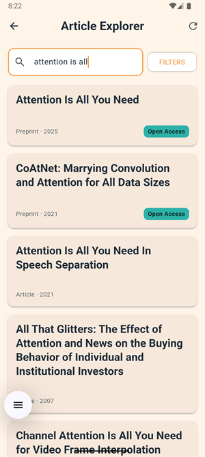
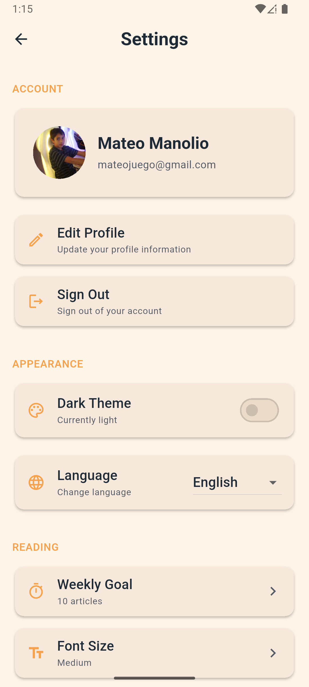

# Artemis App

A Flutter application for exploring and managing scientific publications using the OpenAlex API. Built with Clean Architecture principles, this app provides researchers, students, and knowledge enthusiasts with an intuitive interface to discover, search, filter, and save academic articles.

## Description

Artemis is a modern mobile application designed to facilitate the exploration of scientific publications. It leverages the OpenAlex API to provide access to a vast repository of academic papers, allowing users to search, filter, and save their favorite articles. The app features a clean and intuitive UI, supports multiple languages, and includes features like infinite scrolling, intelligent caching, and offline favorites management.

## Screenshots

Take a visual tour through Artemis and discover how it simplifies your research journey. From the moment you launch the app to exploring articles and managing your preferences, every screen is designed with clarity and ease of use in mind.

### App Icon


The Artemis app icon represents knowledge and discovery, setting the tone for your scientific exploration journey.

### Getting Started: Login Screen


When you first open Artemis, you're greeted with a clean and welcoming login screen. You can sign in securely with your Google account using Firebase Authentication, or choose to skip authentication and explore articles as a guest. The interface supports multiple languages and adapts to your device's theme preferences.

### Your Research Hub: Home Screen


After logging in, the home screen becomes your central command center. Here you can quickly access your favorite articles, view your weekly reading statistics, discover random articles to spark new interests, and navigate to different sections of the app. The intuitive layout makes it easy to jump into your research workflow.

### Explore Articles: Articles Screen



The articles screen is where the magic happens. Browse through thousands of scientific publications from the OpenAlex API with infinite scrolling. Use the powerful search functionality with real-time filtering, or apply advanced filters to narrow down results. Each article card displays key information at a glance, and intelligent caching ensures smooth performance even with large result sets.

### Customize Your Experience: Settings Screen



Personalize Artemis to match your preferences in the settings screen. Change the app language (English, Spanish, or Portuguese), toggle between light and dark themes, set your weekly reading goals, and access information about the app. All your preferences are saved and persist across sessions.

### Key Highlights

- 🔍 **Advanced Search**: Search articles with debounced input and automatic request cancellation
- 📚 **Article Explorer**: Browse articles with infinite scrolling and intelligent caching
- 🔖 **Favorites Management**: Save and manage your favorite articles locally
- 🌍 **Multi-language Support**: Available in English, Spanish, and Portuguese
- 🌓 **Dark Mode**: Full support for light and dark themes
- 📊 **Reading Statistics**: Track your weekly reading progress
- 🎲 **Random Discovery**: Discover random articles to explore new topics
- 🔐 **Secure Authentication**: Google Sign-In powered by Firebase Authentication

## Architecture and Structure

The application follows **Clean Architecture** principles, ensuring separation of concerns and maintainability. The codebase is organized into distinct layers:

### Project Structure

```
lib/
├── main.dart                          # Application entry point
├── firebase_options.dart              # Firebase configuration
├── l10n/                              # Localization files (i18n)
│   ├── app_en.arb                     # English translations
│   ├── app_es.arb                     # Spanish translations
│   └── app_pt.arb                     # Portuguese translations
└── src/
    ├── config/                        # Configuration layer
    │   ├── di/                        # Dependency injection (Riverpod providers)
    │   ├── localization/              # Locale management
    │   ├── route/                     # Navigation (GoRouter)
    │   ├── theme/                     # Theme configuration
    │   └── secrets/                   # Secret keys (not committed)
    ├── core/                          # Core utilities and shared code
    │   ├── converters/                # Data converters (Isar converters)
    │   ├── error/                     # Error handling and exceptions
    │   ├── extensions/                # Dart extensions
    │   ├── interfaces/                # Abstract interfaces
    │   ├── network/                    # Network utilities (Dio)
    │   └── util/                      # Utility classes and constants
    ├── data/                          # Data layer (repositories, datasources, models)
    │   ├── datasource/
    │   │   ├── contracts/             # Data source interfaces
    │   │   ├── local/                 # Local data sources (Isar)
    │   │   └── remote/                # Remote data sources (API, Firebase)
    │   ├── mappers/                   # Data mappers (DTOs ↔ Entities)
    │   ├── models/                    # Data models (DTOs and DB models)
    │   └── repository/                # Repository implementations
    ├── domain/                        # Domain layer (business logic)
    │   ├── contracts/                 # Repository interfaces
    │   ├── entity/                    # Domain entities
    │   └── usecase/                   # Use cases (business logic)
    └── presentation/                  # Presentation layer (UI)
        ├── pages/                     # Screen widgets
        │   ├── articles/              # Article explorer page
        │   ├── details/               # Article details page
        │   ├── home/                  # Home page
        │   ├── login/                 # Login page
        │   └── settings/              # Settings page
        ├── providers/                 # Presentation-level providers
        └── widgets/                   # Reusable widgets
```

### Architecture Layers

1. **Presentation Layer**: Handles UI, user interactions, and state management using Riverpod
2. **Domain Layer**: Contains business logic, entities, and use cases (independent of frameworks)
3. **Data Layer**: Manages data sources (remote API, local database), repositories, and data models

### State Management

The app uses **Riverpod** for state management with code generation:
- Type-safe providers
- Dependency injection
- Reactive state updates
- Easy testing and mocking

### Local Storage

**Isar Community** (community fork) is used for local data persistence:
- Fast, NoSQL database
- Stores favorite articles locally
- User preferences and reading statistics

## Setup and Installation

### Prerequisites

- Flutter SDK (>=3.8.0)
- Dart SDK
- Android Studio / Xcode (for platform-specific builds)
- Firebase project (see [Firebase Configuration](#firebase-configuration))

### Installation Steps

1. **Clone the repository**
   ```bash
   git clone <repository-url>
   cd Artemis
   ```

2. **Install dependencies**
   ```bash
   flutter pub get
   ```

3. **Generate code**
   The project uses code generation for Freezed, Riverpod, and Isar. Run:
   ```bash
   dart run build_runner build --delete-conflicting-outputs
   ```

4. **Generate localizations**
   ```bash
   flutter gen-l10n
   ```

5. **Configure Firebase** (see [Firebase Configuration](#firebase-configuration))

6. **Run the app**
   ```bash
   flutter run
   ```

### Platform-Specific Setup

#### Android
- Minimum SDK: 21
- Ensure `google-services.json` is placed in `android/app/`

#### iOS
- Minimum iOS version: 12.0
- Ensure `GoogleService-Info.plist` is placed in `ios/Runner/`
- Run `pod install` in the `ios/` directory

## Firebase Configuration

The app uses Firebase Authentication with Google Sign-In. Follow these steps to configure Firebase:

### 1. Create a Firebase Project

1. Go to the [Firebase Console](https://console.firebase.google.com/)
2. Create a new project (or use an existing one)
3. Enable **Authentication** and set up **Google Sign-In** as a provider

### 2. Add Firebase to Your App

#### Android Setup

1. Register your Android app in Firebase Console
   - Package name: `com.example.artemis_app`
   - Download `google-services.json`
   - Place it in `android/app/google-services.json`

2. Configure `android/app/build.gradle.kts`:
   ```kotlin
   plugins {
       id("com.google.gms.google-services")
   }
   ```

#### iOS Setup

1. Register your iOS app in Firebase Console
   - Bundle ID: `com.example.artemisApp`
   - Download `GoogleService-Info.plist`
   - Place it in `ios/Runner/GoogleService-Info.plist`

2. Add to `ios/Runner.xcodeproj`:
   - Ensure the `GoogleService-Info.plist` is added to the project

#### Web Setup

1. Register your web app in Firebase Console
2. The configuration is automatically handled via `firebase_options.dart`

### 3. Generate Firebase Options

If you've configured Firebase manually, you may need to regenerate `firebase_options.dart`:

```bash
flutterfire configure
```

This will update `lib/firebase_options.dart` with the correct configuration for all platforms.

### 4. Configure Google Sign-In

1. In Firebase Console → Authentication → Sign-in method
2. Enable **Google** as a sign-in provider
3. For Android: Add the SHA-1 certificate fingerprint to Firebase Console
   ```bash
   keytool -list -v -keystore ~/.android/debug.keystore -alias androiddebugkey -storepass android -keypass android
   ```

## Running Tests

The project includes comprehensive testing at multiple levels:

### Unit Tests

Test individual components (repositories, use cases, services):

```bash
flutter test test/unit/
```

### Widget Tests

Test UI components in isolation:

```bash
flutter test test/widget/
```

### Run All Tests

```bash
flutter test
```

### Integration Tests (Maestro)

The project uses [Maestro](https://maestro.mobile.dev/) for integration testing. These tests simulate real user workflows.

#### Prerequisites

1. **Install Maestro**:
   ```bash
   # macOS/Linux
   curl -Ls "https://get.maestro.mobile.dev" | bash
   
   # Windows (using Scoop)
   scoop install maestro
   ```

2. **Verify installation**:
   ```bash
   maestro --version
   ```

#### Running Integration Tests

1. **Start the app on a device/emulator**:
   ```bash
   flutter run
   ```

2. **Run Maestro tests**:
   ```bash
   maestro test maestro.yaml
   ```

   Or run individual flows:
   ```bash
   maestro test test/integration_test/flows/basic_user_flow.yaml
   ```

#### Available Integration Test Flows

- `basic_user_flow.yaml`: Basic navigation and app flow
- `complete_user_flow.yaml`: Complete user journey (search, filter, favorites)
- `favorite_persistence.yaml`: Favorites persistence testing
- `dark_mode_test.yaml`: Theme switching functionality

The integration tests are defined in YAML files under `test/integration_test/flows/`.

## Main Functionalities

### 1. Authentication

- **Google Sign-In**: Secure authentication using Firebase Authentication
- **Skip Option**: Users can skip authentication and browse without an account
- **Session Management**: Persistent authentication state

### 2. Article Exploration

- **Article Explorer**: Browse articles with infinite scrolling
- **Search**: Real-time article search with debounced input (500ms delay)
- **Request Cancellation**: Automatic cancellation of previous requests when search changes
- **Caching**: Intelligent caching of articles to reduce API calls and improve performance

### 3. Filtering and Search

- **Advanced Filters**: Filter articles by various criteria (e.g., Open Access)
- **Debounced Search**: Optimized search with 500ms debounce to reduce API calls
- **Filter Persistence**: Filters are maintained during navigation

### 4. Article Details

- **Comprehensive Details**: View full article information including:
  - Title, authors, abstract
  - Publication details and dates
  - Metrics (citation count, etc.)
  - Open Access information
  - External links
- **Favorites Toggle**: Save or remove articles from favorites
- **External Links**: Open articles in external browsers

### 5. Favorites Management

- **Local Storage**: Favorites are stored locally using Isar database
- **Offline Access**: Access favorites even without internet connection
- **Quick Access**: View favorites directly from the home screen
- **Persistence**: Favorites persist across app restarts

### 6. Reading Statistics

- **Weekly Goal**: Set and track weekly reading goals
- **Articles Read Counter**: Track how many articles you've read this week
- **Progress Visualization**: Visual indicators of reading progress

### 7. Random Discovery

- **Random Article**: Discover new topics with a random article feature
- **Exploration**: Encourages serendipitous learning

### 8. Localization

- **Multi-language Support**: 
  - English (en)
  - Spanish (es)
  - Portuguese (pt)
- **Auto-detection**: Automatically detects device language
- **Manual Selection**: Change language in settings

### 9. Theme Customization

- **Dark Mode**: Full support for dark and light themes
- **System Preference**: Follows system theme preference
- **Manual Toggle**: Override system preference in settings

### 10. Settings

- **Language Selection**: Change app language
- **Theme Toggle**: Switch between light and dark modes
- **Weekly Goal**: Configure weekly reading goals
- **About Section**: App information and version

## Roadmap

The project has an active roadmap with planned features and improvements. For the latest roadmap, upcoming features, and known issues, please refer to the [HISTORY.md](HISTORY.md) file, which contains:

- Completed features
- Optional features in progress
- Known bugs and their status
- Future enhancements

Some items currently being considered include:
- App icon implementation
- Skeleton loaders for better loading states
- Improved discovery algorithm
- Custom splash screen
- Performance optimizations

## Technology Stack

- **Framework**: Flutter 3.8+
- **Language**: Dart 3.8+
- **State Management**: Riverpod 3.0
- **Local Database**: Isar Community 3.3.0-dev.3
- **Authentication**: Firebase Auth, Google Sign-In
- **HTTP Client**: Dio 5.9
- **Navigation**: GoRouter 16.3
- **Code Generation**: Freezed, Riverpod Generator, Isar Generator
- **Testing**: Flutter Test, Maestro
- **CI/CD**: GitHub Actions

## Contributing

This is a personal project, but suggestions and feedback are welcome. If you'd like to contribute:

1. Fork the repository
2. Create a feature branch
3. Make your changes
4. Ensure all tests pass
5. Submit a pull request

## License

This project is private and not licensed for public use.

---

**Note**: This application is developed for educational purposes and personal use. The OpenAlex API is used in accordance with their terms of service.
